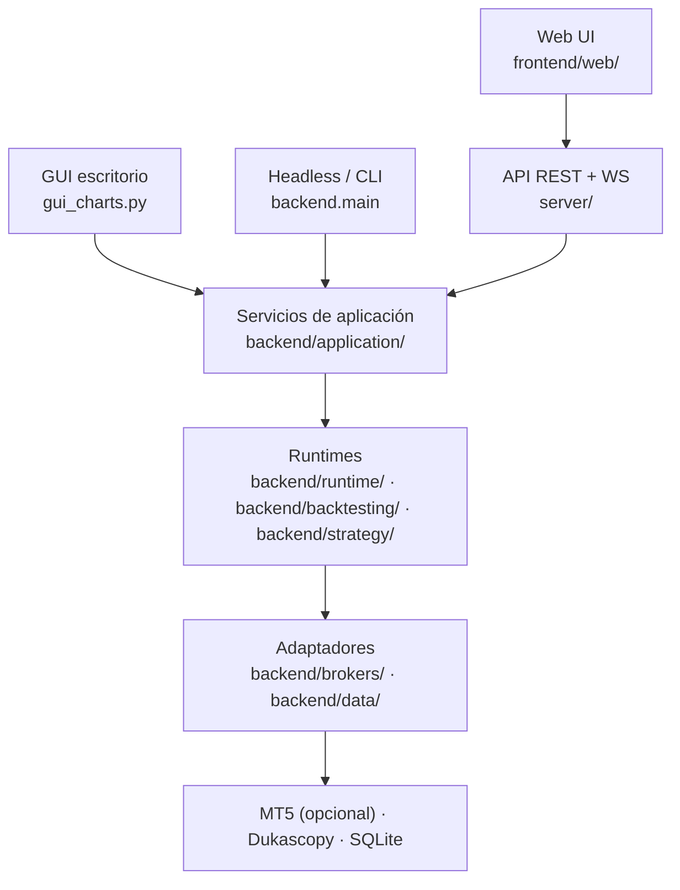

# Strategy Forge

Bot de trading multiestrategia con arquitectura broker-agnóstica, constructor visual de
estrategias, backtesting y tres frontends (GUI de escritorio, web y API REST).

> [!WARNING]
> **Software experimental, para investigación y aprendizaje.** Operar con dinero real es bajo
> tu propia responsabilidad. Nada de este repositorio constituye asesoramiento financiero.
> Prueba siempre primero en cuenta demo o con el broker de papel.

> [!IMPORTANT]
> **Licencia no comercial.** Uso libre para estudio, investigación y proyectos personales.
> El uso comercial —incluido ejecutarlo en producción— requiere acuerdo previo con el autor.
> Ver [Licencia](#licencia).

---

## Qué es

Un sistema que ejecuta varias estrategias de trading a la vez, cada una con su propio
timeframe, y envía las órdenes al broker de forma automática. Las estrategias son módulos
Python independientes: puedes escribirlas a mano o generarlas desde un asistente visual sin
tocar código.

El núcleo no depende de ningún broker concreto. MetaTrader 5 es un adaptador opcional (solo
Windows); un adaptador `paper` en memoria permite ejecutar todo el sistema en Linux o en un
servidor sin MT5.

### Características

- **Multiestrategia concurrente** — varias estrategias en paralelo, cada una con su timeframe,
  su magic number y su propio ciclo de análisis.
- **Strategy Builder** — asistente visual que genera el `.py` de la estrategia a partir de un
  árbol de condiciones. Soporta multi-timeframe (MTF), largos y cortos, niveles de riesgo,
  SL/TP por ATR y pyramiding.
- **13 indicadores** en un registry único: `SMA`, `EMA`, `HMA`, `RSI`, `ATR`, `BB`, `ADX_DI`,
  `DONCHIAN`, `SUPERTREND`, `TCI`, `VORTEX`, `VWAP`, `VOLUME_RATIO`.
- **Backtesting alineado con el runtime en vivo** — mismo motor de señales, para que lo que
  pruebas sea lo que ejecutas. Datos históricos de MT5, Dukascopy o ficheros locales.
- **Persistencia SQLite** — planes, execution reports, legs, fills y event log.
- **Tres frontends** sobre el mismo backend: GUI de escritorio estilo TradingView, web UI
  minimalista y API REST + WebSocket.

---

## Arquitectura



Regla dura del proyecto: `backend/core`, `backend/application`, `backend/runtime` y `server/`
**no importan MT5 directamente**, solo a través de `IBrokerAdapter` / `IHistoricalDataSource`.
El código de MT5 vive aislado en `backend/brokers/mt5/` y `backend/data/mt5_*`. Hay un test
(`tests/test_backend_no_mt5.py`) que lo verifica.

| Directorio | Responsabilidad |
| --- | --- |
| `backend/core/` | Configuración central: símbolo, lotaje, SL/TP, estrategias activas. |
| `backend/application/` | Servicios de proceso compartidos por todos los frontends. |
| `backend/runtime/` | Pipeline v1: context builder, state store, plan interpreter, execution engine. |
| `backend/backtesting/` | Motor de backtesting y su CLI. |
| `backend/brokers/` | `IBrokerAdapter`, factory, broker de papel y adaptador MT5. |
| `backend/data/` | Fuentes de datos históricas y en vivo, indicadores derivados. |
| `backend/strategy_builder/` | Registry de indicadores y generadores de estrategias. |
| `backend/persistence/` | Esquema SQLite, migraciones y repositorios. |
| `server/` | API FastAPI (REST + WebSocket) y servido de la web UI. |
| `frontend/web/` | Web UI y wizard del Strategy Builder. |
| `strategies/` | Estrategias como módulos Python independientes. |

---

## Instalación

Requiere **Python 3.9+**.

```bash
git clone https://github.com/aloantony/strategy-forge.git
```

```bash
cd trading-agent && python install.py
```

`install.py` instala las dependencias y te indica qué está disponible en tu plataforma. Si
prefieres hacerlo a mano, `pip install -r requirements.txt`.

En Linux, la GUI de escritorio necesita además `libwebkit2gtk` del sistema. Si solo vas a usar
el servidor y la web UI, no hace falta.

---

## Puesta en marcha

### Opción A — Servidor + web UI (cualquier plataforma)

Es la vía recomendada para probar el sistema sin MT5:

```bash
TRADING_BROKER=paper uvicorn server.app:app --host 0.0.0.0 --port 8000
```

Abre `http://localhost:8000/`. Desde ahí puedes ver el gráfico, gestionar estrategias y usar el
wizard del Strategy Builder.

### Opción B — GUI de escritorio (Windows + MT5)

Abre MetaTrader 5 y deja la cuenta conectada. Después:

```bash
python gui_charts.py
```

En la pestaña `Estrategias`, activa las que quieras y pulsa `Iniciar motor`.

### Opción C — Headless

```bash
python -m backend.main
```

### Backtesting desde CLI

```bash
python -m backend.backtesting runtime --help
```

---

## Configuración

Los parámetros operativos viven en `backend/core/config.py`:

```python
SYMBOL = "#Germany40"   # DAX. El prefijo varía según el broker
LOT = 0.01
SL_POINTS = 300.0
TP_POINTS = 500.0
ACTIVE_STRATEGIES = []  # Estrategias que arrancan activas
STRATEGY_MAX_WORKERS = 8
```

El broker se elige con la variable de entorno `TRADING_BROKER` (`mt5`, `paper` o `auto`), que
tiene prioridad sobre `config.BROKER`. Con `auto` usa MT5 si está disponible y `paper` si no.

---

## Escribir una estrategia

Una estrategia es un módulo en `strategies/` que expone una función. El contrato mínimo:

```python
import pandas as pd

TIMEFRAME = "M1"  # opcional: timeframe propio de la estrategia

def get_last_signal(df: pd.DataFrame, verbose: bool = False) -> str:
    """Devuelve "buy", "sell" o "none"."""
    if len(df) < 2:
        return "none"
    row = df.iloc[-2]          # siempre la última vela CERRADA
    if row["close"] > row["open"]:
        return "buy"
    if row["close"] < row["open"]:
        return "sell"
    return "none"
```

Opcional pero recomendado:

| Función | Para qué sirve |
| --- | --- |
| `get_last_signal_payload(df, verbose)` | Devuelve `{"signal": ..., "reason": ...}` y el motivo aparece en la GUI. |
| `prepare_dataframe(df)` | Añade columnas de indicadores propios. |
| `compute_signals(df, enable_signals)` | Añade `up_sig` / `dn_sig` para pintar marcadores. |
| `DATA_WINDOW_FIELDS` | Define qué mostrar en el Data Window de la GUI. |
| `MAGIC_NUMBER` | Fuerza un magic number en lugar del generado automáticamente. |

**Las estrategias están aisladas a propósito**: no deben importar `config`, la GUI ni nada del
backend. Reciben un DataFrame ya preparado y devuelven señales. Sin IO, sin conexiones, sin
efectos secundarios.

Guía completa en [`strategies/README.md`](strategies/README.md).

---

## Tests

```bash
python -m pytest tests -q
```

---

## Documentación

La documentación técnica está en [`docs/`](docs/):

- [`docs/wiki/`](docs/wiki/) — wiki HTML navegable, reconstruida verificando el código fuente.
- [`docs/DocsTradingSystemObsidian/`](docs/DocsTradingSystemObsidian/README.md) — vault de
  análisis, arquitectura (con diagramas C4) y diseño por subsistema.
- [`docs/DocsTradingSystemObsidian/00-system-map.md`](docs/DocsTradingSystemObsidian/00-system-map.md)
  — el mejor punto de entrada: el sistema entero en 15 minutos.

---

## Estado del proyecto

En desarrollo activo. La GUI de escritorio (`gui_charts.py`) está congelada a la espera de
dividirse en `frontend/desktop/`; el desarrollo nuevo va al backend, al servidor y a la web UI.
MT5 se mantiene como adaptador opcional, pero la dirección del proyecto es poder correr sin él.

## Licencia

[PolyForm Noncommercial 1.0.0](LICENSE).

**El uso no comercial es libre**: estudiarlo, modificarlo, redistribuirlo, usarlo para
investigación, aprendizaje, proyectos personales o por organizaciones sin ánimo de lucro,
educativas y públicas.

**Cualquier uso comercial requiere un acuerdo por escrito** con el autor. Eso incluye
ejecutarlo en producción, operar con dinero real en un contexto comercial, o integrarlo en un
producto o servicio. Si quieres usarlo así, [abre un issue](https://github.com/aloantony/strategy-forge/issues)
y lo hablamos.

Si redistribuyes el software o parte de él, debes incluir estos términos y la línea
`Required Notice` de [NOTICE.md](NOTICE.md). Cada fichero fuente la lleva ya en su cabecera.
