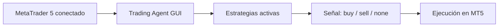

# Trading Agent MT5

Bot de trading modular para MetaTrader 5 con interfaz visual estilo TradingView y soporte para estrategias enchufables.

## Qué puedes hacer con este proyecto

- Operar desde una GUI clara y rápida.
- Ejecutar varias estrategias a la vez.
- Activar/desactivar estrategias sin reiniciar.
- Añadir nuevas estrategias como módulos Python independientes.

## Flujo general



> [!IMPORTANT]
> Abre MetaTrader 5 y deja la cuenta conectada antes de lanzar el bot.

## Inicio rápido en 5 pasos (GUI)

1. Clona el repositorio y entra en la carpeta del proyecto.
2. Instala dependencias:

```bash
pip install -r requirements.txt
```

3. Ajusta `config.py` con tus parámetros básicos:
   - `SYMBOL`
   - `LOT`
   - `SL_POINTS` y `TP_POINTS`
   - `STRATEGY_KEY`, `STRATEGY_MODULE`, `ACTIVE_STRATEGIES` (opcional)
4. Inicia la interfaz:

```bash
python gui_charts.py
```

5. En la pestaña `Estrategias`, usa `Iniciar motor` para comenzar la ejecución automática.

## Cómo usar la interfaz (mapa rápido)

| Acción | Dónde hacerlo |
| --- | --- |
| Iniciar o detener ejecución | `Estrategias` > `Iniciar motor` / `Detener motor` |
| Activar o desactivar una estrategia | `Estrategias` > botón `Activa` / `Inactiva` |
| Seleccionar qué estrategia visualizar | `Estrategias` > click en la estrategia |
| Mostrar/ocultar indicadores | `Object Tree` |
| Ver datos de vela e info de operaciones | `Data Window` |
| Cambiar periodo visible del gráfico | Barra inferior (`1D`, `5D`, `1M`, etc.) |

## Crear una estrategia nueva (desde cero)

Guía completa: `strategies/README.md`  
A continuación tienes el camino corto para arrancar rápido.

### 1) Crea tu módulo

Archivo recomendado:

- `strategies/mi_estrategia.py`

### 2) Implementa la API mínima obligatoria

Tu módulo debe exponer al menos `get_last_signal(df, verbose=False) -> str` y devolver:

- `"buy"`
- `"sell"`
- `"none"`

Plantilla mínima:

```python
import pandas as pd

TIMEFRAME = "M1"  # opcional, pero recomendado

def get_last_signal(df: pd.DataFrame, verbose: bool = False) -> str:
    if len(df) < 2:
        return "none"
    row = df.iloc[-2]  # vela cerrada
    if row["close"] > row["open"]:
        return "buy"
    if row["close"] < row["open"]:
        return "sell"
    return "none"
```

### 3) Actívala por `config.py` (opción estable)

Configura:

```python
STRATEGY_KEY = "mi_estrategia"
STRATEGY_MODULE = "strategies.mi_estrategia"
ACTIVE_STRATEGIES = [STRATEGY_KEY]
```

### 4) O añádela desde la GUI (sin tocar config)

En la pestaña `Estrategias`:

1. Pulsa `Añadir estrategia`.
2. Escribe nombre + módulo (ejemplo: `strategies.mi_estrategia`) y confirma.
3. Alternativa: arrastra tu archivo `.py` a la zona de carga.

## Reglas recomendadas para estrategias

- Mantén la estrategia desacoplada del resto del proyecto.
- Evita importar `config`, `data_feed`, `trading`, `mt5_connection` o la GUI.
- Usa efectos secundarios mínimos (sin IO ni conexiones dentro de la estrategia).

## Estrategias incluidas

- `strategies.strategy_baseline`
- `strategies.strategy_m1_test`
- `strategies.strategy_m1_candle`

## Modo consola (opcional, sin GUI)

También puedes ejecutar el bot en modo script:

```bash
python main.py
```

## Recomendaciones de seguridad

- Prueba primero en cuenta demo.
- Empieza con lotaje bajo.
- Verifica símbolo y horario de mercado antes de operar en real.
