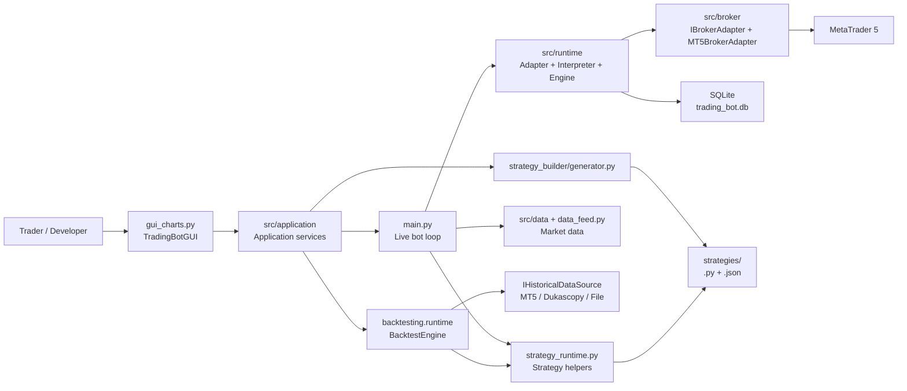
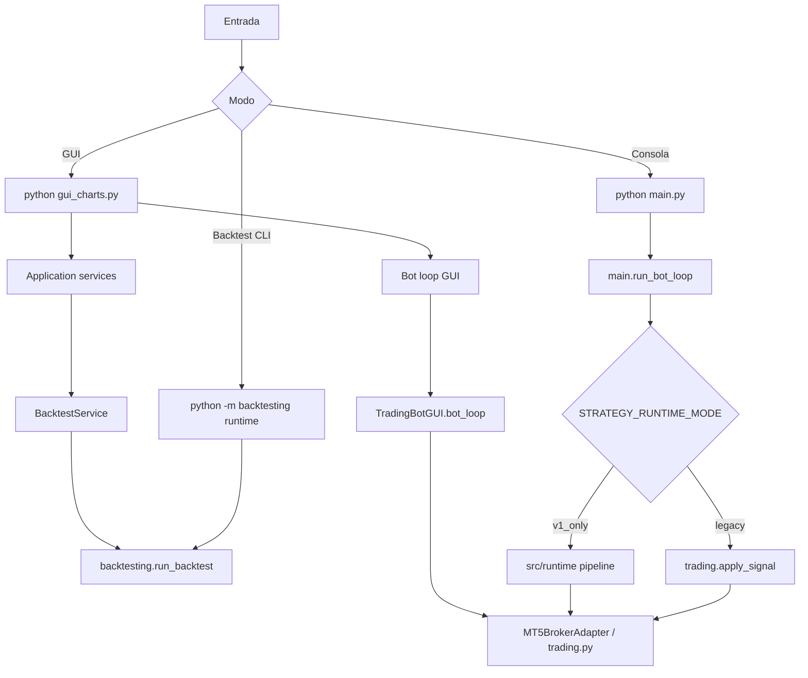

# System Map

Trading Agent es un bot modular para MetaTrader 5 con GUI estilo TradingView, estrategias enchufables, backtesting y un runtime v1 con planes, persistencia y recursos canonicos.

## Vista General

## Modulos De Alto Nivel

| Modulo | Responsabilidad |
| --- | --- |
| `gui_charts.py` | Interfaz visual, captura intencion del usuario, renderiza estado y delega procesos a servicios/runtimes. |
| `src/application/` | Servicios reutilizables para procesos que no deben pertenecer a la GUI. |
| `main.py` | Loop live sin GUI, carga de estrategias, analisis concurrente, runtime v1 y ejecucion legacy. |
| `strategy_runtime.py` | Contrato comun para live, GUI y backtesting: timeframes, preparacion de DataFrame y normalizacion de senales. |
| `trading.py` | Helpers legacy de MT5: mercado abierto, volumen, stops, ordenes, piramidado y riesgo agregado. |
| `src/runtime/` | Supersistema v1: context builder, state store, adapter legacy, plan interpreter y execution engine. |
| `src/broker/` | Contrato `IBrokerAdapter` y adaptador concreto a MT5. |
| `src/data/` | Contratos y fuentes de datos live/historicas: MT5, Dukascopy y file provider. |
| `src/persistence/` | SQLite, migraciones y repositorios para planes, reports, legs, fills y event log. |
| `backtesting/` | Motor de backtesting actual y CLI `python -m backtesting runtime`. |
| `strategy_builder/` | Generador de estrategias desde configuracion JSON. |
| `strategies/` | Estrategias Python independientes y configs generadas. |
| `agents/` | Sistema operativo de agentes, specs, reviews, tareas y contexto. |

## Rutas De Ejecucion

## Fuentes De Verdad

- Config operativa: [config.py](../../config.py).
- Contrato de estrategia: [strategies/README.md](../../strategies/README.md) y [strategy_runtime.py](../../strategy_runtime.py).
- Backtesting actual: [backtesting/FLUJO_BACKTESTING_ACTUAL.md](../../backtesting/FLUJO_BACKTESTING_ACTUAL.md) y [backtesting/runtime.py](../../backtesting/runtime.py).
- Agentes: [agents/context-core.md](../../agents/context-core.md), role files y specs en [agents/specs/](../../agents/specs/).
- Persistencia: [src/persistence/schema.py](../../src/persistence/schema.py), [src/persistence/dal.py](../../src/persistence/dal.py).

## Como Pedir Correcciones

Si un developer detecta una discrepancia entre esta documentacion y el codigo, debe abrir una correccion siguiendo [agents/correction-request.md](agents/correction-request.md). La correccion debe indicar evidencia concreta: archivo, funcion, comportamiento observado y comportamiento esperado.
