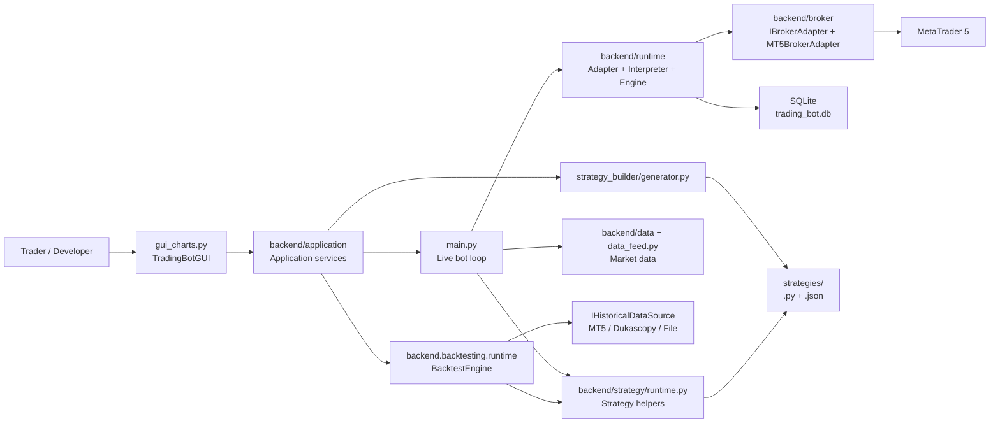
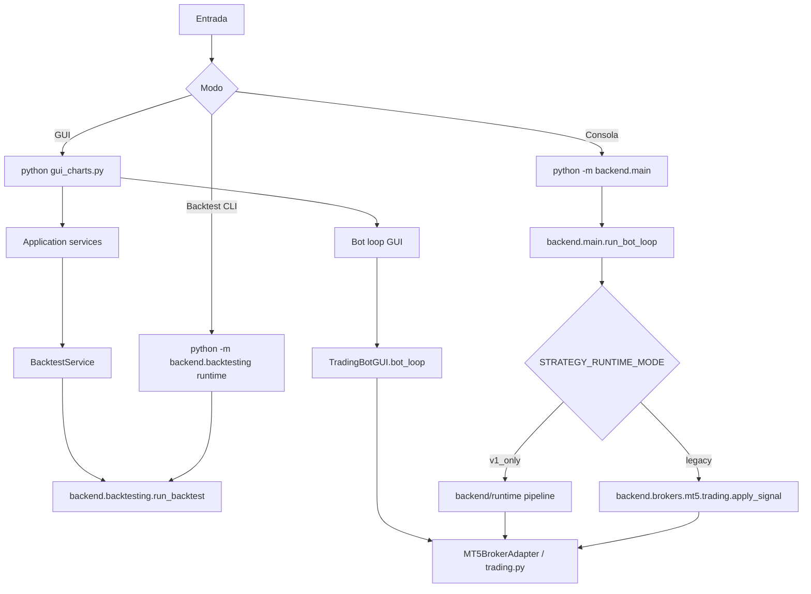

# System Map

Strategy Forge es un bot modular para MetaTrader 5 con GUI estilo TradingView, estrategias enchufables, backtesting y un runtime v1 con planes, persistencia y recursos canonicos.

## Vista General

## Modulos De Alto Nivel

| Modulo | Responsabilidad |
| --- | --- |
| `gui_charts.py` | Interfaz visual, captura intencion del usuario, renderiza estado y delega procesos a servicios/runtimes. |
| `backend/application/` | Servicios reutilizables para procesos que no deben pertenecer a la GUI. |
| `backend/main.py` | Loop live sin GUI, carga de estrategias, analisis concurrente, runtime v1 y ejecucion legacy. |
| `backend/strategy/runtime.py` | Contrato comun para live, GUI y backtesting: timeframes, preparacion de DataFrame y normalizacion de senales. |
| `backend/brokers/mt5/trading.py` | Helpers legacy de MT5: mercado abierto, volumen, stops, ordenes, piramidado y riesgo agregado. |
| `backend/runtime/` | Supersistema v1: context builder, state store, adapter legacy, plan interpreter y execution engine. |
| `backend/brokers/` | Contrato `IBrokerAdapter` y adaptador concreto a MT5. |
| `backend/data/` | Contratos y fuentes de datos live/historicas: MT5, Dukascopy y file provider. |
| `backend/persistence/` | SQLite, migraciones y repositorios para planes, reports, legs, fills y event log. |
| `backend/backtesting/` | Motor de backtesting actual y CLI `python -m backend.backtesting runtime`. |
| `backend/strategy_builder/` | Generador de estrategias desde configuracion JSON. |
| `strategies/` | Estrategias Python independientes y configs generadas. |

## Rutas De Ejecucion

## Fuentes De Verdad

- Config operativa: [config.py](../../backend/core/config.py).
- Contrato de estrategia: [strategies/README.md](../../strategies/README.md) y [backend/strategy/runtime.py](../../backend/strategy/runtime.py).
- Backtesting actual: [backtesting/FLUJO_BACKTESTING_ACTUAL.md](../../backend/backtesting/FLUJO_BACKTESTING_ACTUAL.md) y [backtesting/runtime.py](../../backend/backtesting/runtime.py).
- Persistencia: [backend/persistence/schema.py](../../backend/persistence/schema.py), [backend/persistence/dal.py](../../backend/persistence/dal.py).

## Como Pedir Correcciones

Si detectas una discrepancia entre esta documentacion y el codigo, abre un issue usando la plantilla de [templates/correction-request.md](templates/correction-request.md). Indica evidencia concreta: archivo, funcion, comportamiento observado y comportamiento esperado.
