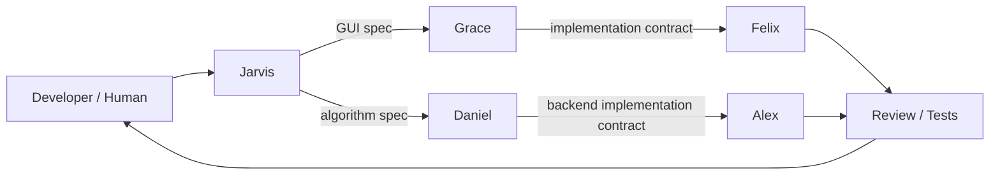

# Agent Map

Esta pagina explica como entender a los agentes del repo. La fuente operativa sigue siendo [agents/](../../../agents/); esta pagina es una guia para developers.

## Roles

| Agente | Rol | Puede modificar codigo | Scope |
| --- | --- | --- | --- |
| Jarvis | Project manager y routing. | Depende de tarea. | Mantiene contexto, backlog y asignacion. |
| Daniel | Algorithm specialist. | No. | Specs y reviews de algoritmos, datos, indicadores, rendimiento. |
| Grace | GUI architect. | No. | Specs previas para cambios no triviales en `gui_charts.py`. |
| Felix | GUI coder. | Si. | Implementa `gui_charts.py` siguiendo spec de Grace o cambios cosmeticos directos. |
| Alex | Backend coder. | Si. | Backend: `backtesting/`, `src/data/`, `src/broker/` concreto, `main.py`, `strategy_runtime.py`, `trading.py`, tests. |

## Handoff

## Artefactos

| Artefacto | Ubicacion | Uso |
| --- | --- | --- |
| Context core | `agents/context-core.md` | Contexto minimo para todos los agentes. |
| Role files | `agents/*.md` | Reglas especificas de cada agente. |
| Tasks | `agents/tasks/<TASK-ID>.md` | Trabajo asignado y contexto de tarea. |
| Backlog index | `agents/tasks.md` | Indice compacto de tareas. |
| Specs | `agents/specs/` | Decision previa a implementacion. |
| Reviews | `agents/reviews/` | Revision post-implementacion o algoritmica. |
| Questions | `agents/questions/` | Bloqueos y preguntas a humano/Jarvis. |
| Templates | `agents/templates/` | Formatos usados por agentes. |

## Como Leer Un Cambio

1. Busca la tarea en `agents/tasks.md`.
2. Abre el task file correspondiente si existe.
3. Si hay spec, abre `agents/specs/<TASK-ID>-...md`.
4. Si toca GUI, espera encontrar spec de Grace antes de implementacion no trivial.
5. Si toca algoritmos o rendimiento, espera encontrar spec/review de Daniel.
6. Revisa el diff contra el scope del agente que implemento.

## Reglas Importantes

- Grace y Daniel no modifican codigo fuente.
- Felix no modifica backend.
- Alex no modifica `gui_charts.py`.
- Los coders no deben tomar decisiones arquitectonicas que pertenecen a specs.
- Si el task esta ambiguo, el agente debe escalar en vez de inventar.

