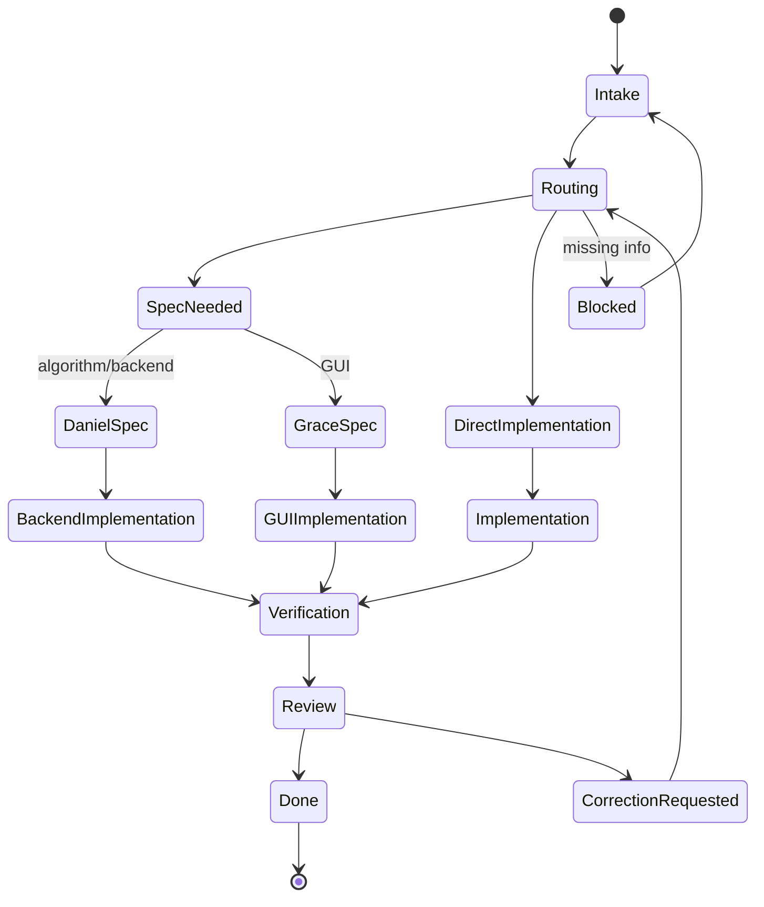

# Task Lifecycle

## Flujo Normal

## Estados Practicos

| Estado | Significado |
| --- | --- |
| Intake | Humano/Jarvis define necesidad. |
| Routing | Se decide agente y si hace falta spec. |
| Spec | Daniel o Grace cierra decisiones antes de implementar. |
| Implementation | Felix o Alex toca archivos segun scope. |
| Verification | Tests, lectura de diff, validaciones manuales. |
| Review | Humano o agente reviewer detecta riesgos. |
| Correction | Se pide cambio concreto con evidencia. |
| Done | Se cierra tarea y se actualiza indice. |

## Que Debe Ver Un Developer

Antes de aprobar:

- La tarea tiene scope claro.
- La spec existe si era necesaria.
- El agente que implementa esta dentro de su scope.
- El diff no toca archivos no relacionados.
- Los tests o validaciones relevantes se ejecutaron o se explico por que no.
- La documentacion se actualizo si cambio arquitectura o contrato.

## Como Pedir Correccion

Usa [correction-request.md](correction-request.md). Una buena correccion dice:

- Que falla.
- Donde se ve.
- Que se esperaba.
- Que archivo o agente parece responsable.
- Como aceptar el fix.

