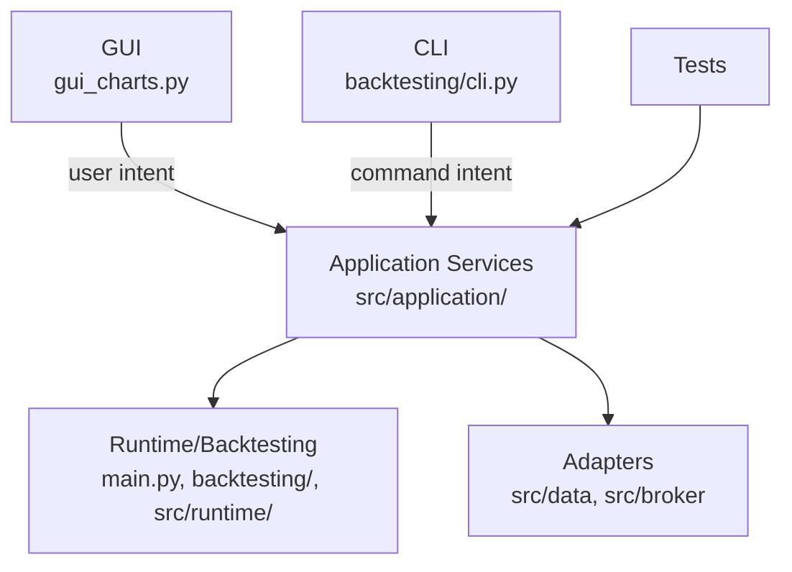

# Application Services Architecture

## Objetivo

La GUI no debe ser duena de procesos de negocio. Las acciones de usuario pueden nacer en `gui_charts.py`, pero la validacion, construccion de requests, resolucion de fuentes y ejecucion reusable deben vivir en `src/application/`.

## Estado Actual

`BacktestService` existe en `src/application/backtest_service.py` y centraliza:

- Parseo de fechas de backtest.
- Validacion de balance, simbolo y estrategia cargada.
- Normalizacion de `data_source`.
- Resolucion de `IHistoricalDataSource`.
- Resolucion de simbolo canonico para el runtime.
- Construccion de requests para `run_backtest` y `run_backtest_comparison`.
- Normalizacion de excepciones de ejecucion a dicts `{status, error}`.

La GUI conserva:

- Estado visual `backtest_state`.
- Render del panel y graficos.
- Threads para no bloquear la interfaz.
- Carga de estrategias desde su registry actual.

## Arquitectura Objetivo

## Servicios Planeados

| Servicio | Estado | Responsabilidad |
| --- | --- | --- |
| `BacktestService` | Implementado inicial | Requests y ejecucion de backtesting. |
| `StrategyRegistryService` | Pendiente | Descubrimiento, carga, params, timeframe, magic number. |
| `StrategyBuilderService` | Pendiente | Preview, validacion, guardado y edicion de estrategias Builder. |
| `LiveRuntimeService` | Pendiente | Loop live compartido por GUI y consola con callbacks de estado. |

## Regla De Cambio

Si un cambio nuevo valida, coordina, ejecuta o construye requests de proceso, no debe vivir directamente en `gui_charts.py`. Debe vivir en `src/application/` o en un runtime/backend existente.
