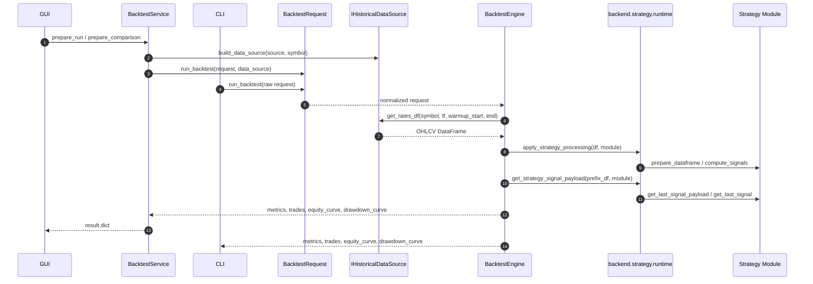

# Backtesting Architecture

El motor activo es `backtesting.runtime`. La GUI lo usa a traves de `BacktestService`; la CLI actual puede llamarlo directamente.

## Flujo

## Semantica Clave

- El backtest carga warmup antes del rango visible.
- La senal se calcula con prefijos crecientes del `DataFrame`.
- La senal se lee en vela cerrada.
- La entrada se ejecuta en el `open` de la siguiente vela visible.
- Si hay posicion abierta al final del rango, se cierra al ultimo `close` con `END_OF_RANGE`.
- Si una vela toca SL y TP, el motor prioriza SL de forma conservadora.

## Modos De Simulacion

| Modo | Activacion | Reglas |
| --- | --- | --- |
| Standard | `buy` o `sell` normal. | Una direccion activa; senal contraria cierra por `REVERSAL` y abre la nueva direccion. |
| Advanced buy | `signal == buy`, `pyramiding == True`, `atr_value > 0`. | Solo largos, permite piramidado si el precio avanza por umbral ATR. |
| Fallback | Payload avanzado incompleto. | Usa modo standard. |

## Resultado

`run_backtest` devuelve un dict con:

- `status`, `error`.
- Identidad: `strategy_key`, `strategy_label`, `symbol`, `digits`, `timeframe`, `data_provider`.
- Rango y balance: `start_date`, `end_date`, `initial_balance`, `final_balance`.
- Metricas: `total_profit`, `total_return_pct`, `closed_trades`, `win_rate`, `max_drawdown`, `profit_factor`, `expectancy`.
- Series: `trades`, `equity_curve`, `drawdown_curve`.
- Costes configurados: `spread_points`, `slippage_points`, `commission_per_lot`.

## Tests De Referencia

- [tests/test_backtest_runtime.py](../../../tests/test_backtest_runtime.py)
- [tests/test_backtesting_cli.py](../../../tests/test_backtesting_cli.py)
- [tests/test_backtest_service.py](../../../tests/test_backtest_service.py)
- [tests/test_dukascopy_historical_source.py](../../../tests/test_dukascopy_historical_source.py)
