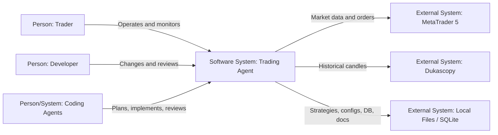
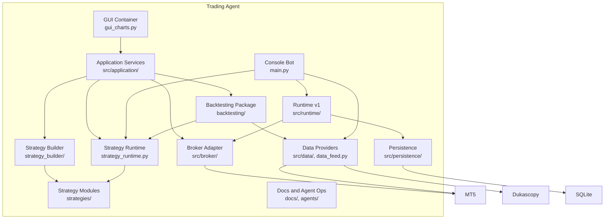
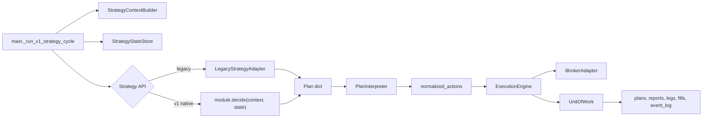
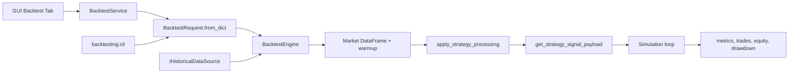
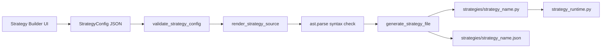

# C4 Architecture

Estos diagramas siguen el modelo C4, pero usan `flowchart` de Mermaid para evitar la sintaxis C4 experimental.

## System Context

## Container Diagram

## Component Diagram: Runtime v1

## Component Diagram: Backtesting

## Component Diagram: Strategy Builder

