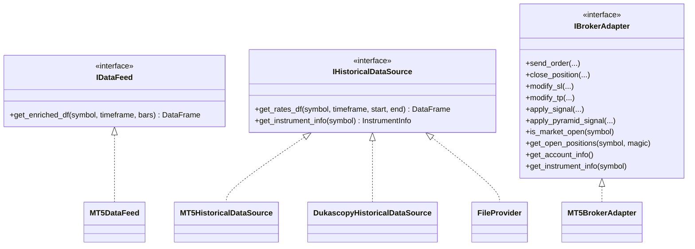
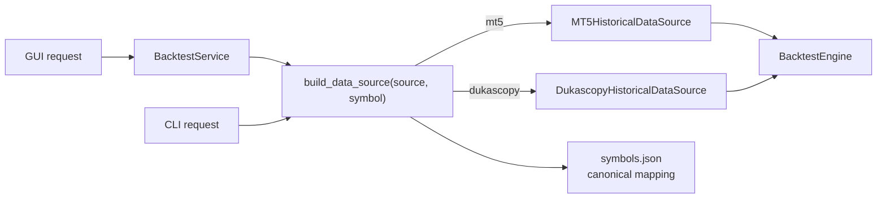

# Data And Broker Architecture

## Interfaces

## Datos Live

`IDataFeed.get_enriched_df` retorna un `DataFrame` listo para estrategia:

- `time`, `open`, `high`, `low`, `close`, `tick_volume`.
- Columnas fuente: `OHLC4`, `HLC3`, `HL2`, `CLOSE`.
- Baseline bands: `average`, `upper`, `lower`, `atr`.
- Supertrend: `supertrend`, `supertrend_dir`, `supertrend_up`, `supertrend_down`.
- TCI: `tci`, `tci_signal`, `tci_hist`.

`backend/main.py` usa `MT5DataFeed` por defecto. `backend/data/data_feed.py` conserva helpers legacy para enriquecer datos y es reutilizado por backtesting.

## Datos Historicos

La factoria:

- No importa `config`.
- Para MT5 devuelve `MT5HistoricalDataSource`.
- Para Dukascopy resuelve simbolo canonico con `symbols.json`.
- Falla temprano si falta `dukascopy-python` o mapping del simbolo.

## Broker

`MT5BrokerAdapter` implementa `IBrokerAdapter` usando `backend/brokers/mt5/trading.py` para:

- Normalizar volumen.
- Ajustar SL/TP a reglas del simbolo.
- Elegir filling mode.
- Reintentar order send con filling compatible.
- Aplicar senales legacy cuando el runtime no usa plan executor.

El adapter es la frontera entre runtime v1 y MT5. Nuevos brokers deben implementar `IBrokerAdapter` sin cambiar `ExecutionEngine`.

## Riesgos

- `backend/brokers/mt5/trading.py` sigue concentrando logica legacy y debe tratarse como modulo compartido sensible.
- `mt5` puede ser `None` si la dependencia no esta disponible.
- Las reglas de simbolo dependen del broker: point, tick size, tick value, volume step, stops level y filling mode.
