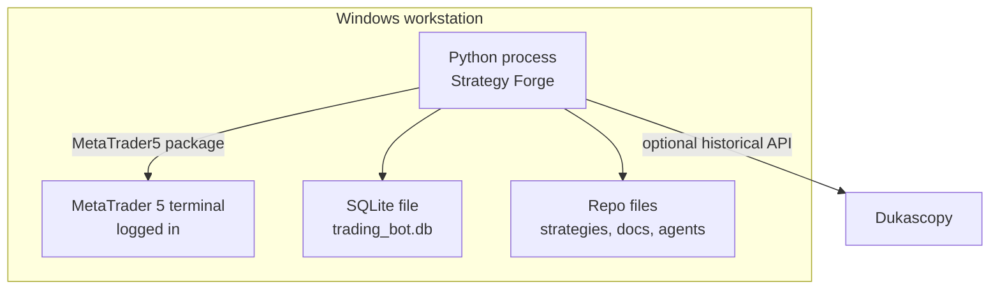

# Deployment Architecture

## Entorno Principal

## Dependencias

Desde [requirements.txt](../../../requirements.txt):

- `MetaTrader5` en Windows.
- `mt5linux` fuera de Windows.
- `pandas`.
- `matplotlib`.
- `customtkinter`.
- `lightweight-charts`.
- `dukascopy-python>=4.0.1`.

## Entrypoints

| Comando | Uso |
| --- | --- |
| `python gui_charts.py` | Modo principal con GUI. |
| `python -m backend.main` | Loop live sin GUI, util para debugging. |
| `python -m backend.backtesting runtime --help` | CLI de backtesting actual. |

## Mac/Linux

`backend/core/config.py` contiene `MT5LINUX_HOST` y `MT5LINUX_PORT`. En plataformas no Windows, el sistema depende de un servidor `mt5linux` conectado a una maquina Windows con MT5.

## Datos Locales

- Estrategias: `strategies/`.
- Config generada por Strategy Builder: `strategies/*.json`.
- Base SQLite: `trading_bot.db` por defecto.
- Documentacion operativa: `docs/`.

## Consideraciones

- MT5 debe estar abierto y con cuenta conectada antes de arrancar.
- El simbolo debe existir y estar visible en Market Watch.
- El prefijo del simbolo depende del broker.
- Para publicar docs HTML no hace falta cambiar runtime; solo anadir toolchain documental.

