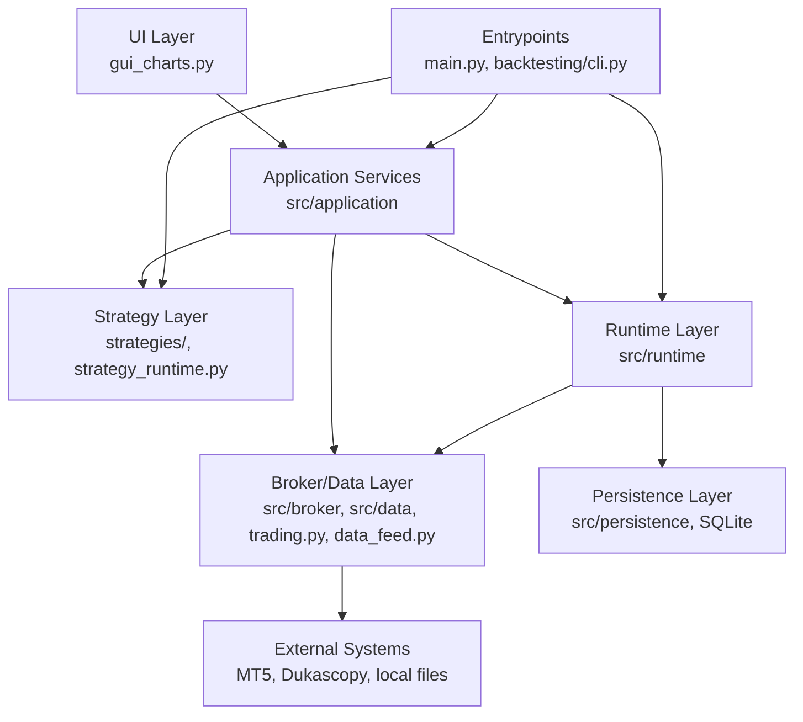
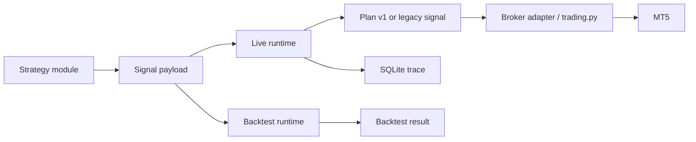

# Architecture Overview

## Capas

## Responsabilidades

| Capa | Responsabilidad | Archivos principales |
| --- | --- | --- |
| UI | Presentacion, eventos visuales, graficos y captura de intencion del usuario. | `gui_charts.py` |
| Application Services | Validacion y orquestacion reusable fuera de la GUI. | `src/application/` |
| Entrypoints | Arranque de modos consola/CLI y loop live. | `main.py`, `backtesting/cli.py` |
| Strategy | Contrato comun y modulos de estrategia. | `strategy_runtime.py`, `strategies/` |
| Runtime v1 | Decision estructurada, planes, ejecucion y estado. | `src/runtime/` |
| Broker/Data | Adaptadores a MT5, fuentes historicas y datos enriquecidos. | `src/broker/`, `src/data/`, `trading.py`, `data_feed.py` |
| Persistence | SQLite, migraciones, repositorios y event log. | `src/persistence/` |
| Agent Ops | Specs, reviews, tareas y roles. | `agents/` |

## Principios De Diseno

- Las estrategias deciden; no ejecutan ordenes.
- La GUI no debe ser duena de procesos de negocio.
- Los procesos reutilizables deben vivir en `src/application/` o en runtimes/backend existentes.
- `strategy_runtime.py` evita duplicar semantica entre live y backtest.
- `IBrokerAdapter` desacopla el motor v1 de MT5.
- `IHistoricalDataSource` desacopla backtesting de la fuente historica.
- `UnitOfWork` y repositorios concentran persistencia.
- Los agentes no deben tomar decisiones fuera de su rol.

## Flujos Principales

## Deuda Arquitectonica Visible

- `gui_charts.py` todavia concentra demasiadas responsabilidades; se esta extrayendo por fases a `src/application/`.
- `trading.py` sigue siendo una capa legacy importante aunque `MT5BrokerAdapter` lo encapsula parcialmente.
- Algunas specs historicas en `agents/specs/` reflejan decisiones previas; antes de implementar se debe contrastar con codigo actual.
- La documentacion vieja y nueva deben convivir hasta que se haga una consolidacion explicita.
