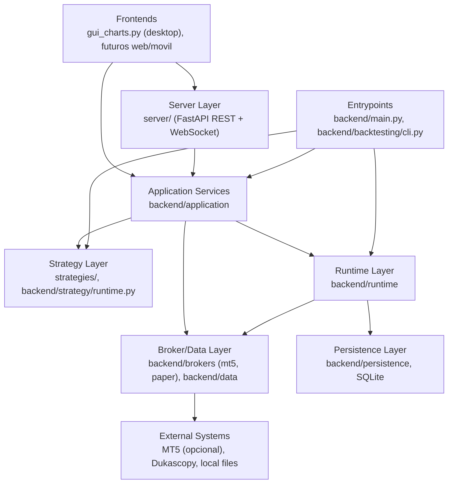
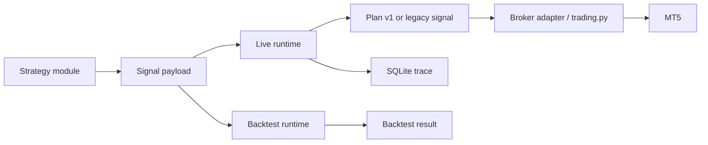

# Architecture Overview

## Capas

## Responsabilidades

| Capa | Responsabilidad | Archivos principales |
| --- | --- | --- |
| Frontends | Presentacion, eventos visuales, graficos y captura de intencion del usuario. | `frontend/web/` (cliente de referencia, servido por el server en `/`); `gui_charts.py` (desktop legacy, congelado — solo fixes criticos) |
| Server | API REST + WebSocket para conectar multiples frontends; broker-agnostico, Linux-ready. Incluye la API del Strategy Builder (`/api/builder/*`: meta con catalogo etiquetado, CRUD y validacion de estrategias v1 y MTF v2). Evolucion prevista: multi-usuario/autenticacion y clientes moviles consumiendo la misma API. | `server/` (`uvicorn server.app:app`), `backend/application/builder_service.py` |
| Application Services | Validacion y orquestacion reusable fuera de la GUI. | `backend/application/` |
| Entrypoints | Arranque de modos consola/CLI y loop live. | `backend/main.py`, `backend/backtesting/cli.py` |
| Strategy | Contrato comun, carga/descubrimiento y modulos de estrategia. `analyze_signal` unifica el analisis v1/MTF (el loop en vivo construye frames por timeframe desde el broker). | `backend/strategy/runtime.py`, `backend/strategy/loader.py`, `strategies/` |
| Runtime v1 | Decision estructurada, planes, ejecucion y estado. | `backend/runtime/` |
| Broker/Data | Adaptadores de broker (`IBrokerAdapter`: mt5/paper via factory) y fuentes de datos. | `backend/brokers/`, `backend/data/` |
| Persistence | SQLite, migraciones, repositorios y event log. | `backend/persistence/` |
| Agent Ops | Specs, reviews, tareas y roles. | `agents/` |

Regla dura: `backend/core`, `backend/application`, `backend/runtime` y `server/` no importan MT5
directamente; MT5 vive en `backend/brokers/mt5/` y `backend/data/mt5_*` como adaptador opcional
(`tests/test_backend_no_mt5.py` lo verifica). En Linux la app corre con el broker `paper`.

## Principios De Diseno

- Las estrategias deciden; no ejecutan ordenes.
- La GUI no debe ser duena de procesos de negocio.
- Los procesos reutilizables deben vivir en `backend/application/` o en runtimes/backend existentes.
- `backend/strategy/runtime.py` evita duplicar semantica entre live y backtest.
- `IBrokerAdapter` desacopla el motor v1 de MT5.
- `IHistoricalDataSource` desacopla backtesting de la fuente historica.
- `UnitOfWork` y repositorios concentran persistencia.
- Los agentes no deben tomar decisiones fuera de su rol.

## Flujos Principales

## Deuda Arquitectonica Visible

- `gui_charts.py` concentra demasiadas responsabilidades; esta congelado como frontend legacy (el cliente de referencia es `frontend/web/`).
- `backend/brokers/mt5/trading.py` sigue siendo una capa legacy importante aunque `MT5BrokerAdapter` lo encapsula parcialmente.
- `backend/main.py` (loop en vivo) sigue acoplado a MT5; la ruta broker-agnostica es el server + `IBrokerAdapter`.
- El bloque PARAMS de las estrategias generadas es declarativo (overrides .params.json sin efecto); cambiar parametros = re-guardar con el Builder.
- Algunas specs historicas en `agents/specs/` reflejan decisiones previas; antes de implementar se debe contrastar con codigo actual.
- La documentacion vieja y nueva deben convivir hasta que se haga una consolidacion explicita.
