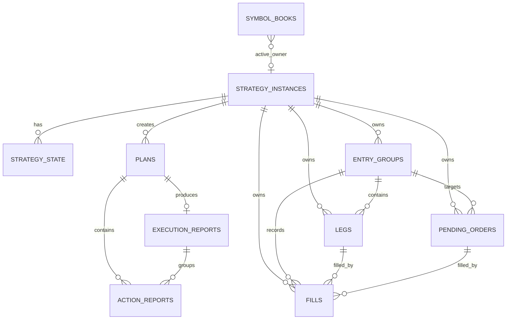
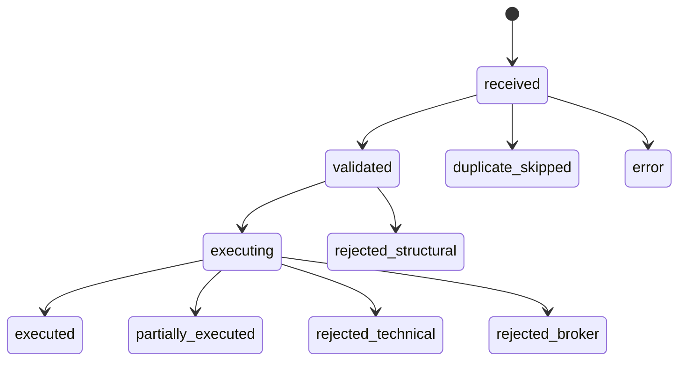

# Persistence Architecture

## Responsabilidad

La persistencia v1 da trazabilidad al runtime:

- Instancias de estrategia.
- Estado por estrategia.
- Planes recibidos y estados de ejecucion.
- Reports por plan y por accion.
- Recursos canonicos: entry groups, legs, pending orders, fills.
- Event log append-only.

## Bootstrap

`bootstrap_persistence(db_path)` abre SQLite, aplica pragmas y migraciones pendientes. En live lo llama `backend.main.main()` si `PERSISTENCE_ENABLED = True`.

## ER Diagram

## Tablas Principales

| Tabla | Proposito |
| --- | --- |
| `schema_migrations` | Versiones aplicadas. |
| `strategy_instances` | Instancia logica de estrategia por simbolo. |
| `symbol_books` | Ownership de simbolo y revision de book. |
| `strategy_state` | Estado serializado y revision por instancia. |
| `plans` | Planes recibidos, validados, ejecutados o rechazados. |
| `execution_reports` | Resultado agregado por plan. |
| `action_reports` | Resultado por accion. |
| `entry_groups` | Agrupacion canonica de legs. |
| `legs` | Posiciones o partes de posicion. |
| `pending_orders` | Ordenes pendientes canonicas. |
| `fills` | Ejecuciones registradas. |
| `event_log` | Eventos operativos append-only. |

## Repositorios

`backend/persistence/dal.py` expone repositorios por tabla y `UnitOfWork`. La capa runtime debe escribir a traves de estos repositorios, no con SQL disperso.

## Estados Relevantes

## Invariantes

- `event_log` no usa foreign keys duras para ser robusto.
- `strategy_state.revision` debe aumentar al persistir nuevo estado.
- `plans.plan_json` y report JSON son serializados por DAL.
- Las escrituras de runtime live estan protegidas por locks en `backend/main.py`.

