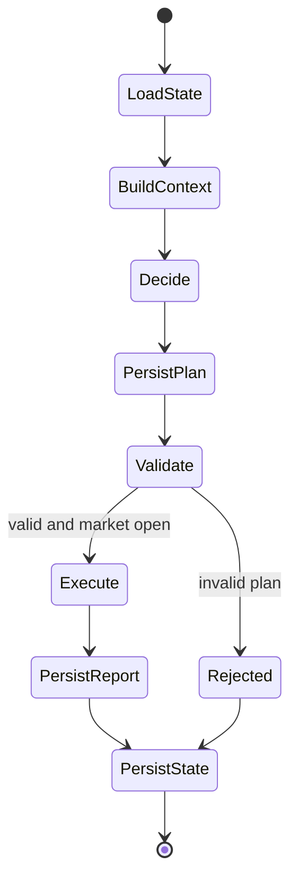

# Runtime Architecture

## Modos

`config.STRATEGY_RUNTIME_MODE` controla el camino principal:

- `legacy`: analiza senales y ejecuta con `trading.apply_signal`.
- `dual`: modo de transicion historico.
- `v1_only`: todos los modulos pasan por runtime v1 si `PLAN_EXECUTOR_ENABLED` y persistencia estan activos.

En la configuracion actual, `STRATEGY_RUNTIME_MODE = "v1_only"`, `PLAN_EXECUTOR_ENABLED = True` y `PERSISTENCE_ENABLED = True`.

## Flujo v1

```mermaid
sequenceDiagram
  autonumber
  participant Loop as main.run_bot_loop
  participant DF as DataFeed
  participant Strategy as Strategy Module
  participant Context as StrategyContextBuilder
  participant Adapter as LegacyStrategyAdapter / decide
  participant Interp as PlanInterpreter
  participant Engine as ExecutionEngine
  participant Broker as MT5BrokerAdapter
  participant DB as SQLite

  Loop->>DF: get enriched market DataFrame
  Loop->>Strategy: analyze strategy payload for scheduling metrics
  Loop->>Context: build context
  Context->>DB: load owned resources and state context
  Loop->>Adapter: decide(context, state)
  Adapter-->>Loop: plan + next_state
  Loop->>DB: insert plan_received
  Loop->>Interp: validate_and_normalize(plan, context)
  Interp-->>Loop: normalized_actions
  Loop->>Engine: execute_plan(plan, normalized_actions)
  Engine->>Broker: send_order / close_position / modify
  Engine->>DB: reports, legs, fills, event_log
  Loop->>DB: persist next_state
```

## Legacy Strategy Adapter

`LegacyStrategyAdapter` envuelve estrategias que solo conocen el contrato legacy:

- Reconstruye `DataFrame` desde `context.market.frames`.
- Ejecuta `prepare_dataframe`, `compute_dir1_and_signals` o `compute_signals` si existen.
- Llama `get_last_signal_payload` o `get_last_signal`.
- Traduce `buy/sell/none` a acciones v1:
  - `buy` sin long abierta: `open_position long`.
  - `buy` con short abierta: `close_position short` y `open_position long`.
  - `sell` simetrico.
  - `none`: sin acciones.

## Plan Interpreter

`PlanInterpreter` valida estructura y resuelve valores concretos:

- `size_spec` a volumen.
- `stop_spec` a precio de SL.
- `take_profit_spec` a precio de TP.
- Targets de cierre o reduccion.
- Acciones soportadas: abrir, anadir, cerrar, reducir, mover SL, mover TP y pending orders basicas.

No ejecuta nada. Si falla, lanza `PlanValidationError`.

## Execution Engine

`ExecutionEngine` ejecuta acciones normalizadas:

- Usa `IBrokerAdapter`.
- Persiste `execution_reports` y `action_reports`.
- Crea `entry_groups`, `legs` y `fills` cuando abre posiciones.
- Actualiza estado de legs/grupos al cerrar.
- Escribe eventos en `event_log`.

## Estado



## Invariantes

- Las estrategias no llaman al broker.
- La ejecucion real pasa por `ExecutionEngine` en modo v1.
- Cada plan debe tener `plan_id`.
- La persistencia debe recibir `instance_id`, `strategy_key`, `symbol` e `iteration_id`.
- Las acciones sin mercado abierto no deben ejecutarse.

