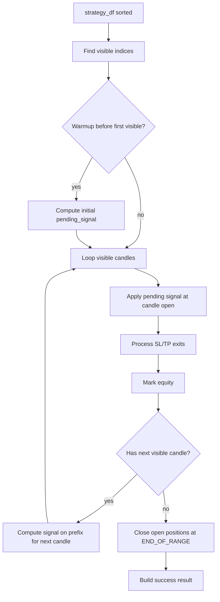

# Backtesting Design

## Objetivo

Simular estrategias con la semantica mas cercana posible al runtime live sin tocar posiciones reales.

## Request

`BacktestService` prepara el request desde entradas GUI/CLI y `BacktestRequest.from_dict` normaliza el request final dentro del runtime:

- `strategy_key`, `strategy_label`, `module`.
- `symbol`.
- `timeframe_value`.
- `start_date`, `end_date`.
- `initial_balance`.
- `warmup_bars`.
- `lot`, `sl_points`, `tp_points`.
- `spread_points`, `slippage_points`, `commission_per_lot`.
- `data_provider`.

## DataFrame

`_build_market_dataframe`:

1. Resuelve label de timeframe.
2. Calcula `warmup_start`.
3. Llama `data_source.get_rates_df`.
4. Ordena por `time`.
5. Aplica `data_feed.add_source_columns`.

Luego `run_with_df` aplica procesamiento de estrategia con `strategy_runtime.apply_strategy_processing`.

## Loop De Simulacion

## Costes

El request soporta:

- Spread en puntos.
- Slippage en puntos.
- Comision por lote.

Estos costes afectan entrada y balance en la simulacion.

## Limitaciones

- No modela order book real.
- No modela rechazos de broker.
- El modo avanzado actual es long-only.
- Dynamic sizing avanzado se marca pero el lote real queda diferido por falta de metadata live completa en ese punto.

## Acceptance Basica Para Cambios

- Tests de `src/application/backtest_service.py` deben pasar si cambia validacion/request building.
- Tests existentes de `tests/test_backtest_runtime.py` deben pasar.
- Cambios de semantica deben actualizar [../architecture/backtesting.md](../architecture/backtesting.md).
- Si se modifica payload, revisar `strategy_runtime.py`, GUI y live loop.
