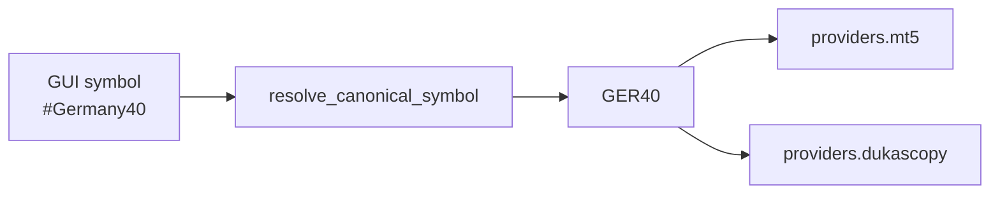

# Broker And Data Adapter Design

## Objetivo

Separar el core del sistema de proveedores concretos. MT5 es la implementacion actual, no debe ser una suposicion dentro de todos los modulos nuevos.

## Broker Adapter

`IBrokerAdapter` define:

- Ejecucion tecnica: `send_order`, `close_position`, `modify_sl`, `modify_tp`.
- Senales de alto nivel legacy: `apply_signal`, `apply_pyramid_signal`.
- Estado: mercado abierto, posiciones, cuenta e instrumento.

`MT5BrokerAdapter` traduce esas llamadas a MT5 y helpers de `trading.py`.

## Data Interfaces

`IDataFeed` es para live: entrega `DataFrame` enriquecido.

`IHistoricalDataSource` es para backtesting: entrega OHLCV historico y metadata de instrumento.

## Symbol Mapping

`src/data/symbols.json` mapea simbolos canonicos con proveedores. Ejemplo conceptual:

## Nuevo Data Source

Para anadir una fuente historica:

1. Implementar `IHistoricalDataSource`.
2. Resolver `get_rates_df` con columnas esperadas.
3. Resolver `get_instrument_info`.
4. Anadir caso en `build_data_source`.
5. Anadir mapping si usa simbolo distinto.
6. Cubrir con tests de fuente y backtesting.

## Nuevo Broker

Para anadir un broker:

1. Implementar `IBrokerAdapter`.
2. No importar `config` para parametros que puedan inyectarse.
3. Normalizar resultados en `OrderResult`, `AccountInfo`, `InstrumentInfo`.
4. Mantener semantica de `send_order` y `close_position`.
5. Probar `ExecutionEngine` con fake adapter antes de broker real.

## Reglas

- Nuevos modulos de datos que toquen MT5 deben proteger import si aplica.
- No usar `trading.py` desde codigo nuevo salvo que sea deliberado adapter legacy.
- No duplicar metadata de simbolo fuera de `symbols.json` o del broker.

