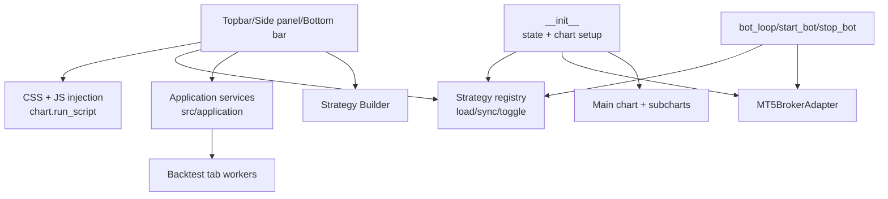

# GUI Design

## Rol

`gui_charts.py` implementa `TradingBotGUI`, la interfaz principal. Debe capturar intencion del usuario y renderizar estado; los procesos reutilizables deben moverse a `src/application/` o a runtimes/backend existentes.

## Estructura Logica

## Strategy Registry

La GUI usa `self.strategy_registry` como fuente de verdad local. Cada entry incluye datos como:

- `key`, `label`, `module_ref`, `module_obj`.
- `enabled`.
- `last_signal`, `last_df`, `last_error`, `last_run_at`.
- `magic_number`.

Nuevas features visuales deben leer de registry antes que de `config.ACTIVE_STRATEGIES`, salvo que el cambio sea explicitamente de configuracion.

## Marcadores de operaciones (entradas/salidas)

`update_chart` agrupa los deals de MT5 por vela y clasifica cada grupo como **entrada** o **salida**:

- **Entrada** (hay algun `DEAL_ENTRY_IN`/`INOUT`): flecha direccional — verde "Compra" (arriba abajo)
  o roja "Venta" (arriba). Apertura o reversion.
- **Salida** (solo `DEAL_ENTRY_OUT`): circulo "Cierre" con color por resultado (verde/rojo/gris) y la
  causa real anexada (p.ej. "Cierre · SL"). La causa sale de `deal.reason` nativo
  (SL/TP/Stop Out/Reversion-Bot/Manual), no del comentario.

El emparejado entrada↔salida (round-trip) vive en `src/analytics/trade_history.py`
(`build_round_trips`, `resolve_exit_cause`, `points_from_price_delta`) — logica pura, testeada en
`tests/test_trade_markers.py`. La GUI la consume via wrappers (`_build_round_trips`,
`_resolve_deal_exit_cause`) y la expone en:

- Tooltip de cierre (`_format_deal_group_tooltip`): causa, resultado en € / % / puntos y duracion.
- Data Window (`_format_deals_for_data_window` + `_renderTrades`): etiqueta `OUT · <causa>`.

Pendiente (no implementado): tooltip en HTML coloreado, lineas SL/TP de posiciones abiertas y overlay
multi-estrategia con color por magic.

## JS/Python Bridge

La GUI usa tres patrones:

- Python a JS con `self.chart.run_script`.
- Python a JS con `json.dumps` para payloads estructurados.
- JS a Python con `window.callbackFunction(handler + "_~_" + arg)`.

Los cambios con JS deben cuidar braces de f-string. Preferir JSON para payloads complejos.

## Threading

Contextos relevantes:

- Main thread: setup, eventos principales y `chart.show()`.
- Bot loop thread: ejecucion automatica.
- Quote/callback threads: actualizaciones y handlers.

Segun los role files actuales, cualquier cambio no trivial a `gui_charts.py` debe pasar por Grace para spec y Felix para implementacion.

## Backtest GUI

La GUI:

- Delega validacion, construccion de request y datasource en `BacktestService`.
- Lanza worker thread para no bloquear UI.
- Llama `BacktestService.execute_run` o `BacktestService.execute_comparison`.
- Renderiza metricas, equity, drawdown y tablas.

## Regla De Servicios

No anadir nueva orquestacion de proceso directamente a `gui_charts.py`. Si el cambio valida, coordina, ejecuta o construye requests reutilizables, debe ir a `src/application/` o a un runtime/backend existente.

## Reglas Para Cambios

- No tocar `gui_charts.py` sin leer metodos completos afectados.
- No hacer refactors oportunistas.
- Nuevos DOM nodes deben ser idempotentes.
- Nuevas llamadas a config deben usar `getattr(config, "KEY", default)`.
- Cambios de Strategy Builder o Backtest GUI suelen requerir spec de Grace.
