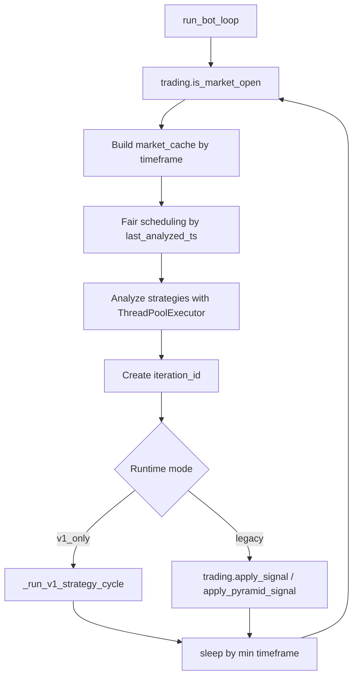

# Live Runtime Design

## Objetivo

Ejecutar estrategias activas sobre datos live, respetando timeframes, limites de concurrencia, estado persistente y frontera de broker.

## Carga De Estrategias

`main.load_active_strategies()`:

- Descubre modulos en `strategies/`.
- Resuelve `STRATEGY_KEY`, `STRATEGY_MODULE` y `ACTIVE_STRATEGIES`.
- Carga parametros `PARAMS` desde modulo o JSON.
- Calcula magic number por estrategia.
- Resuelve timeframe por estrategia.

## Loop

## Concurrencia

- `STRATEGY_MAX_WORKERS` limita hilos.
- `STRATEGY_ANALYSIS_TIMEOUT_SECONDS` limita tiempo total de analisis.
- `MAX_ORDERS_PER_ITERATION` limita ordenes por ciclo.
- `ORDER_EXECUTION_LOCK` serializa ejecucion de ordenes.
- `_db_lock` protege escrituras SQLite compartidas.

## Decision Y Ejecucion

En modo `v1_only`:

1. Analiza estrategia para obtener metricas de senal.
2. Construye contexto v1.
3. Carga estado.
4. Ejecuta `decide()` o `LegacyStrategyAdapter`.
5. Persiste plan.
6. Valida y normaliza acciones.
7. Ejecuta con `ExecutionEngine`.
8. Persiste `next_state`.

En modo legacy:

1. Usa payload normalizado de `strategy_runtime.py`.
2. Si hay piramidado valido y senal `buy`, llama `trading.apply_pyramid_signal`.
3. En caso contrario llama `trading.apply_signal`.

## Puntos De Extension

- Nuevo proceso reusable: crear servicio en `src/application/` y llamarlo desde GUI/CLI.
- Nueva API de estrategia v1: implementar `STRATEGY_API_VERSION = 1`, `initial_state` opcional y `decide(context, state)`.
- Nuevo broker: implementar `IBrokerAdapter` y pasar al `ExecutionEngine`.
- Nueva fuente live: implementar `IDataFeed`.

## Zonas De Riesgo

- No mezclar llamadas directas a `trading.py` dentro de runtime v1 nuevo.
- No anadir nueva orquestacion live directamente a `gui_charts.py`; extraer a servicio si debe ser reusable.
- No bloquear el loop con IO pesado dentro de estrategias.
- No cambiar semantica de `strategy_runtime.py` sin revisar backtesting.
- No modificar locks sin entender SQLite y envio de ordenes.
