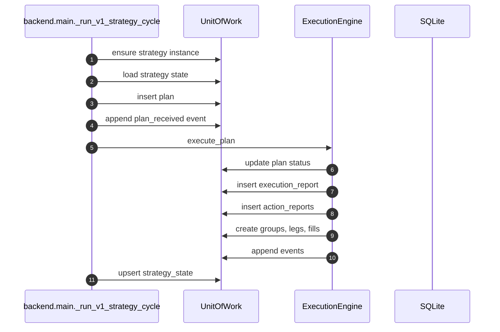

# Persistence Design

## Objetivo

Registrar decisiones y ejecuciones de forma auditable sin acoplar el runtime a SQL disperso.

## Unit Of Work

`UnitOfWork` agrupa repositorios y transacciones. El runtime live usa locks alrededor de operaciones SQLite porque comparte conexion global.

## Escrituras Del Runtime

## Recurso Canonico

- `entry_group`: agrupacion de una tesis de entrada.
- `leg`: unidad de posicion gestionada.
- `fill`: evento de ejecucion.
- `pending_order`: orden pendiente.

## Serializacion

Los campos `*_json` se manejan como dict/list en repositorios y se serializan centralmente. No conviene escribir JSON a mano fuera del DAL.

## Evolucion De Schema

Las migraciones viven en `schema.py` como lista ordenada. Para cambios futuros:

1. Anadir nueva migracion con version incremental.
2. Mantener compatibilidad con datos existentes.
3. Actualizar repositorios si cambia forma de escritura/lectura.
4. Anadir test de migracion o DAL.
5. Actualizar [../architecture/persistence.md](../architecture/persistence.md).

## Riesgos

- Los `except Exception: pass` en runtime protegen el loop, pero pueden ocultar fallos de trazabilidad. Si se investiga persistencia, revisar event log y tests.
- Cambios de status deben respetar `CHECK` constraints de SQLite.
- `event_log` debe permanecer robusto y append-only.

