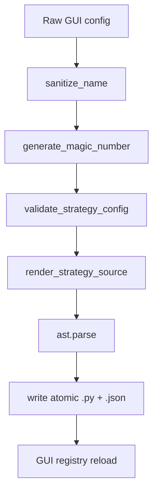

# Strategy Builder Design

## Objetivo

Generar estrategias Python desde una configuracion estructurada sin que el usuario escriba codigo manualmente.

## Pipeline

## Artefactos

- `strategies/strategy_<name>.py`: modulo ejecutable.
- `strategies/strategy_<name>.json`: configuracion editable.

## Validacion

`validate_strategy_config` valida:

- Campos requeridos.
- `schema_version`.
- Nombre, display name y timeframe.
- Magic number.
- Indicadores soportados.
- Arboles de condicion.
- Columnas disponibles.
- Colisiones de nombres.
- `payload_extra_fields`: clave (identificador), `type` (`literal`/`column`) y, para `column`, que la columna exista (se interpola en el codigo generado, asi que se valida para evitar columnas inexistentes/inyeccion).

## Generacion

`render_strategy_source` emite:

- Docstring.
- Imports.
- Constantes de modulo.
- `PARAMS`.
- Object tree y Data Window fields.
- Helpers matematicos necesarios.
- `prepare_dataframe` si hay indicadores custom.
- `compute_signals`.
- `get_last_signal_payload`.
- `get_last_signal`.

Antes de escribir, ejecuta `ast.parse` para validar sintaxis.

## Reglas

- El generador no debe ser importado por estrategias generadas.
- Las estrategias generadas deben cumplir el contrato normal de `strategy_runtime.py`.
- Edicion de una estrategia Builder debe preservar magic number.
- Si hay una estrategia manual con el mismo nombre, debe fallar por colision.
- El nombre de maquina se deriva del `display_name` (`sanitize_name`); la GUI muestra el id como
  campo de solo lectura. El backend es la fuente unica de verdad del naming.
- `generate_magic_number(strategies_dir)` escanea los `.json` existentes y devuelve un magic libre,
  garantizando unicidad entre estrategias.

## Integracion GUI

`gui_charts._on_strategy_builder_save` enruta el guardado por `handle_save_new` / `handle_save_edit`
(no llama a `generate_strategy_file` directamente): asi la validacion, el naming, el magic y la
limpieza de ficheros en rename viven en el backend. La GUI solo traduce las excepciones
(`ValidationError`, `NameCollisionError`, `GeneratorError`) a mensajes y actualiza el registro.

