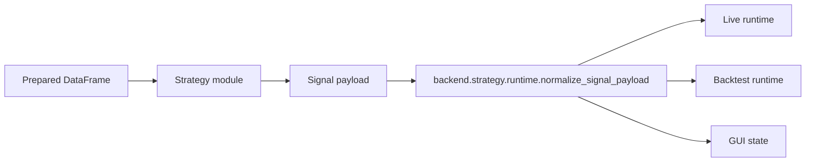

# Strategy System Design

## Objetivo

Permitir estrategias Python independientes, reutilizables en live, GUI y backtest, sin acoplarlas a MT5 ni a la GUI.

## Contrato



## API Legacy

Obligatorio:

```python
def get_last_signal(df, verbose=False) -> str:
    ...
```

Recomendado:

```python
def get_last_signal_payload(df, verbose=False) -> dict:
    ...
```

Opcional:

- `prepare_dataframe(df)`.
- `compute_signals(df, enable_signals)`.
- `compute_dir1_and_signals(df, enable_signals)`.
- `TIMEFRAME`, `STRATEGY_TIMEFRAME`, `TIMEFRAME_STR`.
- `DATA_WINDOW_FIELDS`.
- `STRATEGY_OBJECT_TREE_ITEMS`.
- `PARAMS`.
- `MAGIC_NUMBER`.

## Payload Normalizado

`backend.strategy.runtime.normalize_signal_payload` produce:

- `signal`.
- `reason`.
- `pyramiding`.
- `atr_value`.
- `dynamic_sizing`.
- `volume_ratio`.
- `sl_atr_mult`.
- `tp_atr_mult`.
- `pyramid_atr_mult`.

## API v1 Nativa

Una estrategia v1 puede exponer:

- `STRATEGY_API_VERSION = 1`.
- `initial_state(context)`.
- `decide(context, state) -> {"plan": ..., "next_state": ...}`.

El plan resultante pasa por `PlanInterpreter` y `ExecutionEngine`.

## Reglas De Aislamiento

Las estrategias no deben:

- Importar `config`, `trading`, `data_feed`, `mt5_connection` o `gui_charts`.
- Enviar ordenes.
- Leer/escribir archivos durante decision, salvo que la tarea lo justifique.
- Depender de estado global mutable no controlado.

## Compatibilidad Live/Backtest

El mismo modulo debe poder ejecutarse en:

- GUI para visualizacion y senales.
- Live runtime.
- Backtesting.

Por eso la semantica comun vive en `backend/strategy/runtime.py`.

