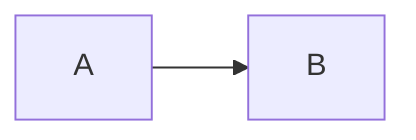

# Site Publishing

Esta carpeta esta preparada para convertirse en HTML sin reescribir la documentacion. La decision actual es mantener Markdown portable y diagramas Mermaid inline.

## Recomendacion

Usar **Material for MkDocs** cuando se quiera publicar HTML:

- Encaja con un repo Python.
- Lee Markdown desde `docs/`.
- Tiene busqueda, navegacion y tema oscuro/claro.
- Puede renderizar Mermaid mediante `pymdownx.superfences`.
- No obliga a convertir los documentos a MDX.

Docusaurus es una alternativa razonable si el proyecto acaba necesitando una web React/Node con componentes interactivos. Para esta documentacion tecnica, MkDocs es mas simple.

## Reglas Para Mantener Compatibilidad

- Usar enlaces relativos Markdown, por ejemplo `texto -> ../path/to/file.py`.
- Evitar wiki-links como `[[file]]` en contenido canonico.
- Mantener diagramas como bloques:

````markdown

````

- Evitar HTML embebido salvo que sea imprescindible.
- Mantener un `title` en frontmatter para futuras herramientas.
- No depender de plugins de Obsidian para interpretar contenido.

## Futuro `mkdocs.yml` Sugerido

```yaml
site_name: Strategy Forge Docs
docs_dir: docs/DocsTradingSystemObsidian
theme:
  name: material
  features:
    - navigation.sections
    - navigation.instant
    - search.suggest
markdown_extensions:
  - admonition
  - tables
  - pymdownx.superfences:
      custom_fences:
        - name: mermaid
          class: mermaid
          format: !!python/name:pymdownx.superfences.fence_code_format
```

No se crea `mkdocs.yml` en esta fase para no introducir una toolchain nueva antes de que se pida el HTML.
