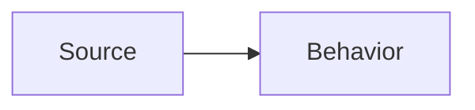

# <Title>

## Purpose

Explica para que existe esta pagina y que decision o parte del sistema documenta.

## Summary

Resumen corto de la idea principal.

## Diagram

## Design Notes

- Punto de diseno 1.
- Punto de diseno 2.
- Punto de diseno 3.

## Invariants

- Invariante que no debe romperse.
- Contrato que debe mantenerse.

## Change Guidance

- Que revisar antes de cambiar esta parte.
- Que agente debe intervenir si aplica.
- Que tests o validaciones ejecutar.

## Sources

- Link a codigo o spec fuente.

